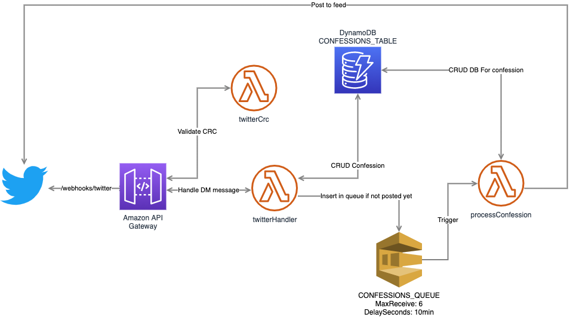

# Confessions Bot
[Versão em português](README.md)  

[Confi](https://twitter.com/confissoes_bot) is a robot that publishes on twitter confessions that have been sent on robot's profile DM and posts the confession on its feed with a funny comment on it. The project was inspired in a famous page called [cconfissões](https://twitter.com/cconfissoes). 


## The project

The project is simply a service made with serverless on AWS and its structure consists of a http service with an API Gateway that receives requests from the twitter webhook.  

Those messages are processed on a lambda function that registers the messages on dynamodb for an user and posts the id of the user with timestamp on a SQS queue that has a delay and will be used latter to trigger a lambda function that parses the aggregate of messages and make the image to post on the feed and makes the post updating the collection on dynamodb.  

If it's not possible on successfully conclude the process of the queue in 6 tries it posts the message on a DLQ that can be used to debug and reprocess the message once the service is fixed.



## Next steps  
Even thought the project is ready and functional, and also funny, there are stil a lot of improvements to be made to make it even more interesting:    
- [x] Suport to emojis
- [ ] Robot feedback on DM
- [ ] Admin validation system for the post

### The payload
The payload received from the twitter's DM message:  

```json
{
    "for_user_id": "1363121963309412354",
    "direct_message_events": [
        {
            "type": "message_create",
            "id": "1371204467341807621",
            "created_timestamp": "1615755595418",
            "message_create": {
                "target": {
                    "recipient_id": "1133857316862910464"
                },
                "sender_id": "1363121963309412354",
                "source_app_id": "3033300",
                "message_data": {
                    "text": "fodijfosidjf",
                    "entities": {
                        "hashtags": [],
                        "symbols": [],
                        "user_mentions": [],
                        "urls": []
                    }
                }
            }
        }
    ],
    "apps": {
        "3033300": {
            "id": "3033300",
            "name": "Twitter Web App",
            "url": "https:\\/\\/mobile.twitter.com"
        }
    },
    "users": {
        "1363121963309412354": {
            "id": "1363121963309412354",
            "created_timestamp": "1613828589653",
            "name": "Confiss\\u00f5es UFPE",
            "screen_name": "ConfissoesUfpe",
            "description": "Fa\\u00e7a uma confiss\\u00e3o an\\u00f4nima, envie a indireta pro seu crush ou conte algumas indigna\\u00e7\\u00f5es para outros universit\\u00e1rios sofredores \\ud83d\\ude09",
            "protected": false,
            "verified": false,
            "followers_count": 1,
            "friends_count": 1,
            "statuses_count": 1,
            "profile_image_url": "http:\\/\\/abs.twimg.com\\/sticky\\/default_profile_images\\/default_profile_normal.png",
            "profile_image_url_https": "https:\\/\\/abs.twimg.com\\/sticky\\/default_profile_images\\/default_profile_normal.png"
        },
        "1133857316862910464": {
            "id": "1133857316862910464",
            "created_timestamp": "1559167625174",
            "name": "Caio Gomes \\ud83d\\udc94",
            "screen_name": "minimarvindroid",
            "description": "Tamo ai convivendo nesse mundo louco",
            "protected": false,
            "verified": false,
            "followers_count": 142,
            "friends_count": 335,
            "statuses_count": 2396,
            "profile_image_url": "http:\\/\\/pbs.twimg.com\\/profile_images\\/1133857434257285125\\/XQT23I7x_normal.jpg",
            "profile_image_url_https": "https:\\/\\/pbs.twimg.com\\/profile_images\\/1133857434257285125\\/XQT23I7x_normal.jpg"
        }
    }
}
```