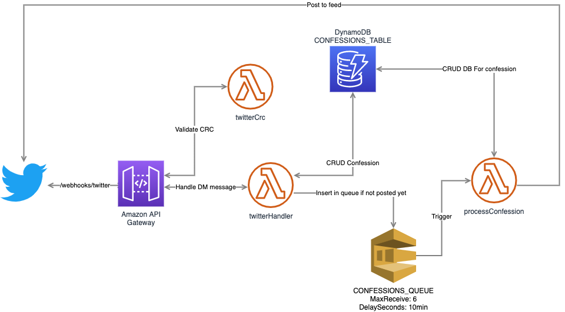

# Confissoes Bot
[Versão em inglês](README-en.md)  

[Confi](https://twitter.com/confissoes_bot) é um robô que publica no twitter confissões que são enviadas na DM do robô e faz o post de forma anônima com algum comentário engraçadinho. Foi inspirado em uma página do twitter chamada [cconfissões](https://twitter.com/cconfissoes). 


## O projeto

O projeto é basicamente um robô construído com uma infraestrutura serverless.  

Consiste de um serviço HTTP na AWS com um API Gateway que recebe requisições do webhook do twitter, é processado por uma função lambda que faz o registro da mensagem em um banco Dynamodb e faz a publicação de um registro em uma fila do SQS com atraso que vai ser utilizada para disparar uma função lambda.  

Essa função vai validar se deve postar, gerar a imagem que deve ser postada no feed e atualizar a coleção do ddb para garantir que o registro já foi postado. Caso não seja possível efetivar o post em até 6 tentativas de trigger a mensagem vai ser jogada em uma DLQ de forma que é possível realizar o debug do que ocorreu e posteriormente forçar um reprocessamento ao corrigir algum bug.  



## Próximos passos  
Apesar do projeto já estar funcional e ser bem divertido ainda existem muitas melhorias que podem ser adicionadas para tornar ainda mais interessante:  
- [x] Suporte a Emojis
- [ ] Resposta do robô na DM do usuário
- [ ] Sistema de validação para o Admin antes de fazer o Post

### O payload
O payload que é recebido do twitter para uma DM é o seguinte: 

```json
{
    "for_user_id": "1363121963309412354",
    "direct_message_events": [
        {
            "type": "message_create",
            "id": "1371204467341807621",
            "created_timestamp": "1615755595418",
            "message_create": {
                "target": {
                    "recipient_id": "1133857316862910464"
                },
                "sender_id": "1363121963309412354",
                "source_app_id": "3033300",
                "message_data": {
                    "text": "fodijfosidjf",
                    "entities": {
                        "hashtags": [],
                        "symbols": [],
                        "user_mentions": [],
                        "urls": []
                    }
                }
            }
        }
    ],
    "apps": {
        "3033300": {
            "id": "3033300",
            "name": "Twitter Web App",
            "url": "https:\\/\\/mobile.twitter.com"
        }
    },
    "users": {
        "1363121963309412354": {
            "id": "1363121963309412354",
            "created_timestamp": "1613828589653",
            "name": "Confiss\\u00f5es UFPE",
            "screen_name": "ConfissoesUfpe",
            "description": "Fa\\u00e7a uma confiss\\u00e3o an\\u00f4nima, envie a indireta pro seu crush ou conte algumas indigna\\u00e7\\u00f5es para outros universit\\u00e1rios sofredores \\ud83d\\ude09",
            "protected": false,
            "verified": false,
            "followers_count": 1,
            "friends_count": 1,
            "statuses_count": 1,
            "profile_image_url": "http:\\/\\/abs.twimg.com\\/sticky\\/default_profile_images\\/default_profile_normal.png",
            "profile_image_url_https": "https:\\/\\/abs.twimg.com\\/sticky\\/default_profile_images\\/default_profile_normal.png"
        },
        "1133857316862910464": {
            "id": "1133857316862910464",
            "created_timestamp": "1559167625174",
            "name": "Caio Gomes \\ud83d\\udc94",
            "screen_name": "minimarvindroid",
            "description": "Tamo ai convivendo nesse mundo louco",
            "protected": false,
            "verified": false,
            "followers_count": 142,
            "friends_count": 335,
            "statuses_count": 2396,
            "profile_image_url": "http:\\/\\/pbs.twimg.com\\/profile_images\\/1133857434257285125\\/XQT23I7x_normal.jpg",
            "profile_image_url_https": "https:\\/\\/pbs.twimg.com\\/profile_images\\/1133857434257285125\\/XQT23I7x_normal.jpg"
        }
    }
}
```